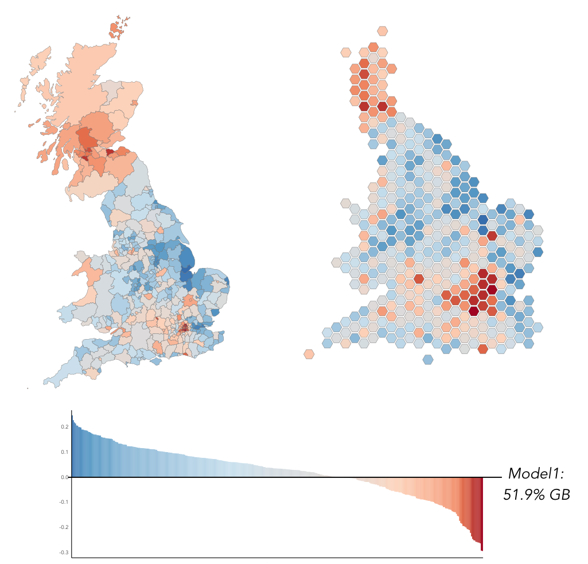
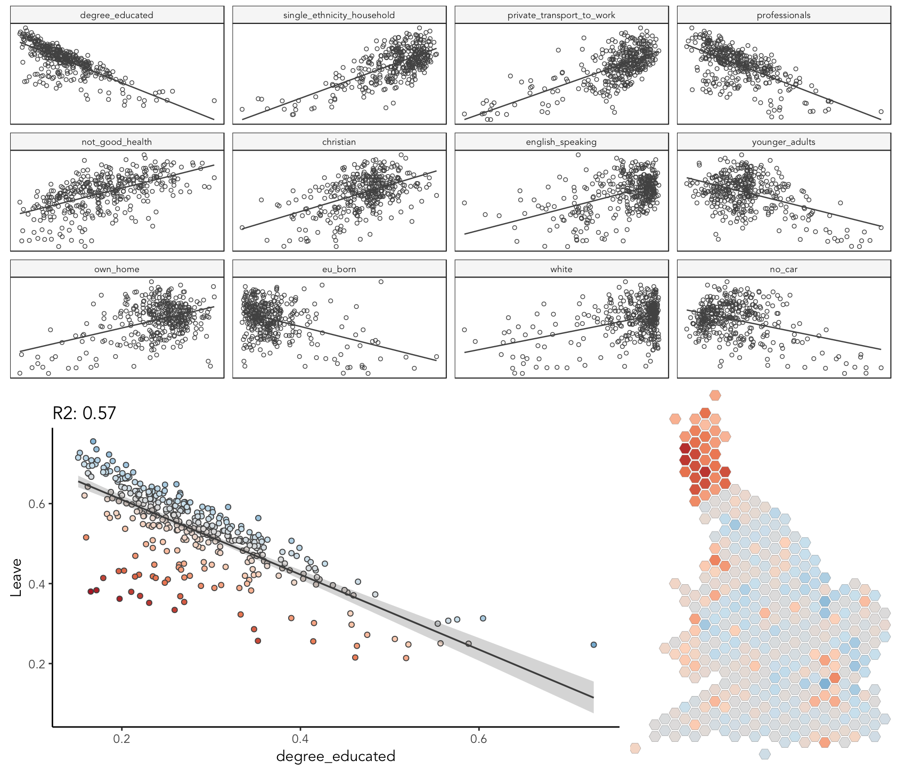
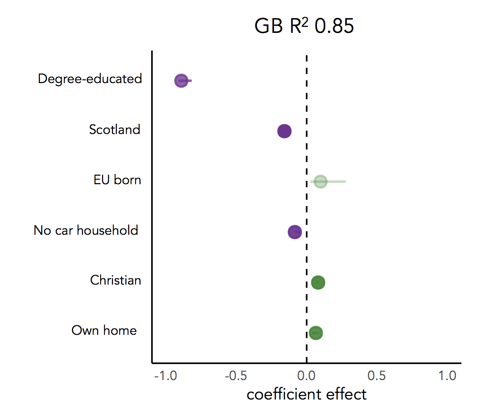
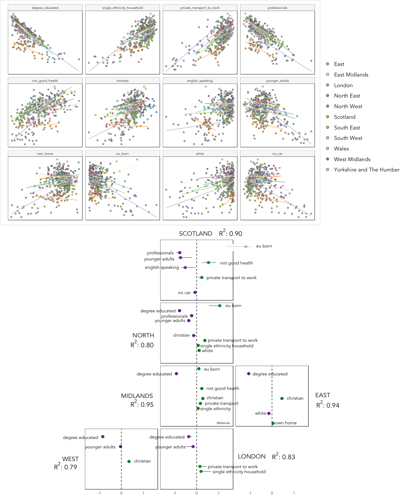
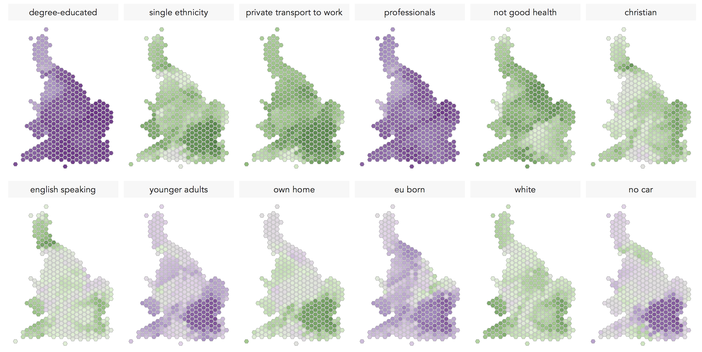
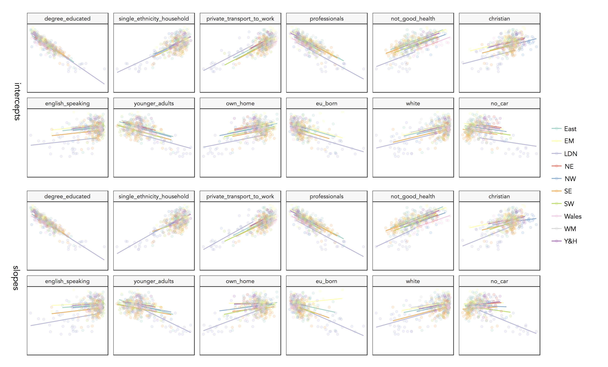

This repository supports a data analysis exploring locally varying explanations behind the UK's vote to leave the EU. This work is ongoing, but preliminary findings were presented at [GISRUK 2017](http://manchester.gisruk.org) ([abstract](http://huckg.is/gisruk2017/GISRUK_2017_paper_75.pdf) | [talk](http://www.staff.city.ac.uk/~sbbm143/gisruk2017_brexit_talk.pdf)).

The general plan is to consider how closely the media narrative around the Leave vote is borne out in data. We repeat the same methods taken by Political Scientists -- explore how Local Authority-level (LA) results data co-vary with key socio-economic characteristics collected through the 2011 Census -- but pay particular attention to whether these associations differ for different parts of the country. We do so by considering whether spatial patterns exist in our global model fits (we produce many residual maps) and by building *local* models.

Below is a summary of the selected 2011 Census variables and the 'concepts', discussed in the popular discourse around the result, we assume they represent.

| 2011 Census variable | Concept |
|:--------------------:|:----------------:|
| *degree-educated* |                               |
| *professional occupations* | post-industrial / knowlegde economy |
| *younger adults* | |
|--------------------|----------------|
| *English speaking* | |
| *single-ethnicity* | |
| *not good health* | diversity / values / outcomes |
| *white British/Irish* | |
| *Christian* | |
| *EU-born (not UK)* | |
|--------------------|----------------|
| *own home*  | |
| *don't own car* | metropolitan / 'big city' |
| *private transport to work* |  |
|--------------------|----------------|

## Configure R and load data

```{r, echo=TRUE, eval=FALSE}
# --- Libraries ---
# Spatial data handling
library(rgdal) 
library(rgeos) 
library(rmapshaper)
# Charting and organising data
library(tidyverse)
# Working with factor variables within Tidyverse
library(forcats)
# Gw-stats
library(GWmodel)
# Modelling functions that work with pipe (and Tidyverse)
library(modelr)
library(broom)
# Lasso functions 
library(glmnet)
# Multi-level models
library(lme4)
library(piecewiseSEM)
# --- Data ---
source("src/load_data.R") # May take some time to execute.
```

## Uniform model that assumes each LA votes in the same proportions as GB



We start by comparing the results data against a uniform model that assumes each Local Authority votes for Leave in same proportion as Great Britain (GB) as a whole. This results in residual maps that were widely published in the aftermath of the vote. They demonstrate that our uniform model overestimates the Leave vote in Scotland and London, whilst the corollary is true for much of England and Wales. Notice a few exceptions: the dark red of Cambridge surrounded by (generally) blue.  

That these very obvious patterns exist -- Scotland and London look categorically distinct -- we can ask whether there is something fundamentally different about LAs in those regions.

```{r, echo=TRUE, eval=FALSE}
# --- Maps of residuals ---
# Tidy SDF into DF for use in ggplot2.
data_gb_df <- tidy(data_gb)
gb_hex_df <- tidy(gb_hex)
# We lose the attribute information, so need to add this in.
data_gb$id <- row.names(data_gb)
data_gb_df <- left_join(data_gb_df,data_gb@data, by=c("id"="id"))
gb_hex$id <- row.names(gb_hex)
gb_hex_df <- left_join(gb_hex_df,gb_hex@data, by=c("id"="id"))

# Choropleth of residuals. 
data_gb_df %>%
  mutate(model1 = Leave-0.51) %>%
    ggplot(mapping=aes(x=long, y=lat, group = group, fill = model1)) +
    geom_polygon( colour = "grey50", size=0.1 ) +
    coord_equal() +
    scale_fill_distiller(type="div", palette=5, direction=1, guide="colourbar", limits=c(-0.297,0.297))
```

## Univariate linear regression model



We start with the _degree-educated_ variable -- that is proportion of residents in a LA educated to bachelors level or higher. This is the most heavily correlated variable (inversely) with the Leave vote and variation in it explains 57% of the variation between LAs in their share of Leave. Looking at the scatterplot, we see that these residuals are not ideally distributed around the regression line: a set of LAs  where our model still overestimates the Leave vote given the levels education in those areas. And from the map: that these LAs are overwhelming concentrated in Scotland. 

By excluding Scotland, the residuals are more randomly distributed around the regression line and we can explain 80% of variation in LA-level voting preference in England & Wales with variation in the _degree-educted_ variable. But the residuals exhibit spatial structure and we can make a case for local models.

```{r, echo=TRUE, eval=FALSE}
# Variables ordered by correlation coefficient for charting.
order_explanatory <- data_gb@data %>% 
  gather(c(younger_adults:eu_born), key = "expl_var_order", value="la_prop") %>%
    group_by(expl_var_order) %>%
      summarise(correlation = stats::cor(Leave, la_prop)) %>%
        arrange(desc(abs(correlation))) %>%
          mutate(order=row_number(), label = paste(order, expl_var_order, sep=": ")) 
# Scatter plots of candidate explanatory variables.
data_gb@data %>% 
  gather(c(younger_adults:eu_born), key = "expl_var", value="la_prop") %>%
    mutate(expl_var=fct_relevel(expl_var,order_explanatory$expl_var_order)) %>%
      ggplot(aes(x=la_prop, y=Leave))+
      geom_point(colour="#525252",pch=21) +
      stat_smooth(method=lm, se=FALSE, size=0.6, colour="#525252")+
      facet_wrap(~expl_var, scales="free")+
      theme_bw()

# --- Univariate linear model on degree-educated variable ---
m_gb_degrees <- lm(Leave~ degree_educated, data_gb@data)
# Perform a bootstrap for evaluating model uncertainty.
resamples <- modelr::bootstrap(data_gb@data, 1000) %>% 
                mutate(model = purrr::map(strap,~lm(Leave ~ degree_educated, .))) %>% 
                  transmute(
                      .id,
                      data = purrr::map2(list(data_gb@data %>% select(geo_code, degree_educated)), model, modelr::add_predictions, var = "predicted")
                    ) %>%
                    unnest()  %>%
                      group_by(geo_code) %>%
                        summarise(
                          lower = quantile(predicted, 0.025),
                          upper = quantile(predicted, 0.975)
                        )
# Add model residuals and bootstrap intervals on predicted values.
data_gb@data <- data_gb@data %>% 
                  mutate(resids_gb_degrees = resid(m_gb_degrees)) %>%
                    inner_join(., resamples)
# And to hex cartogram for mapping.
gb_hex@data <- inner_join(gb_hex@data, data_gb@data %>% select(geo_code, resids_gb_degrees), by=c("geo_code"="geo_code")) 

# Scatterplot with model residuals and bootstrap confidence interval.
data_gb@data %>% 
  ggplot(aes(x=degree_educated, y=Leave))+ 
  geom_point(mapping=aes(fill=resids_gb_degrees),colour="#525252",pch=21) +
  stat_smooth(method=lm, se=FALSE, colour="#525252", size=0.6)+
  geom_ribbon(aes(ymin=lower, ymax=upper), alpha=0.2)+
  scale_fill_distiller(palette=5, type="div", direction=1, guide="colourbar", limits=c(-0.27,0.27))+
  ggtitle("R2: 0.57")+
  theme_classic()

# Map of residuals.
gb_hex_df <- left_join(gb_hex_df,gb_hex@data %>% select(id, resids_gb_degrees), by=c("id"="id"))
gb_hex_df %>%
  ggplot(mapping=aes(x=long, y=lat, group = group, fill = resids_gb_degrees)) +
  geom_polygon( colour = "grey50", size=0.1 ) +
  coord_equal() +
  scale_fill_distiller(palette=5, type="div", direction=1, guide="colourbar", limits=c(-0.27,0.27)) +
  ggtitle("R2: 0.57") 
```


## Multivariate linear regression model, fit using LASSO

{ width=50% }

Here we investigate other variables that are confounded with Leave. We do so by building a global multivariate regression model on these variables but add Scotland and London -- areas that we see as categorically distinct -- as dummy variables. We fit our multivariate model using LASSO [(Tibshirani 1996)](http://www.jstor.org/stable/2346178?seq=1#page_scan_tab_contents). LASSO is similar to OLS (it tries to minimise the sum of residuals in the same way) but also adds a penalty on the sum of regression coefficients to make sure they don’t get too large -- large coefficients may suggest overfitting. Particularly useful is that LASSO performs variable selection by shrinking the least important coefficients to zero, removing them from the model. 

In the Figure are regression coefficients for a multivariate model fit with our 14 explanatory variables. The line through the regression coefficients and their transparency varies with confidence intervals calculated from a bootstrap. The outcome is share of Leave vote so negative coefficients have the effect of lowering the Leave vote. Our LASSO has identified six variables. The _degree-educated_ variable consistently has the highest coefficient value. Holding the other variables constant, a one percent point increase _degree-educated_ decreases the Leave vote by 0.9 percent points. The fact that Scotland is selected by our LASSO model also makes sense given the earlier chart. There is something fundamentally different about Scotland, not accounted for completely by our census variables, that lowers preference for Leave. The _EU-born_ variable is counter to what we would expect from the scatterplots, where it is negatively associated with Leave and so might represent the 'diversity' and 'openness' of an LA. Rather, when we hold the other variables constant, an increase in the _EU-born_ population also *increases* the Leave vote -- there is a sense here that the variable describes change as a result of EU-migration in some pejorative way.


```{r, echo=TRUE, eval=FALSE}
# --- Fit model using LASSO ---
# Generate dummy variables.
data_gb@data <- data_gb@data %>%
                  mutate(
                    scotland = as.numeric(Region=="Scotland"),
                    london = as.numeric(Region=="London")
                    ) 
# Lasso on GB data.
xvars_gb <- data_gb@data %>% select(younger_adults:eu_born, c(scotland, london))
x_gb <- as.matrix(xvars_gb)
y_gb <- as.matrix(data_gb@data %>% select(Leave)) 
fit_gb <- glmnet(x_gb,y_gb, alpha=1)
cv_fit_gb <- cv.glmnet(x_gb,y_gb, alpha=1)
# Fitted values and residuals from Lasso for interpretation. 
xvars_gb <- xvars_gb %>% 
          mutate(
            fitted =  as.numeric(predict.glmnet(fit_gb, newx=x_gb, s =  cv_fit_gb$lambda.1se)),
            obs = as.numeric(y_gb),
            resid = obs-fitted
          )
# --- Generate a bootstrap for LASSO coefficients ---
# Function for returning Lasso model output.
do_lasso_boot <- function(data) {
                  explanatory <- as.matrix(data$data %>% select(younger_adults:eu_born,c(scotland, london)))
                  outcome <- as.matrix(data$data %>% select(Leave))
                  return(cv.glmnet(explanatory, outcome, alpha=1))
                }
models <- modelr::bootstrap(data_gb@data %>% select(geo_code:london), 1000) %>% 
              mutate(
                model = purrr::map(strap,do_lasso_boot),
                coef = purrr::map(model, ~coef(., s="lambda.1se")),
                coef = coef %>% as.matrix %>% purrr::map(broom::tidy)
                ) %>%
                  unnest(coef) %>%
                    group_by(row) %>%
                      summarise(
                        lower=quantile(value,0.025, na.rm = TRUE),
                        upper=quantile(value,0.975, na.rm = TRUE)
                        ) %>%
                          filter(row!="(Intercept)")
# Extract coefficients from the GB model.                  
observed <- as_tibble(broom::tidy(coef(cv_fit_gb, s = "lambda.1se"))) %>%
              mutate(observed=value) %>%
                select(row, observed) %>%
                  filter(row!="(Intercept)")
# Join with coefficients from bootstrap.
models <- left_join(models,observed) 

# -- Dotplot of coefficients and bootstrap 'uncertainty' --- 
# Map() function for scaling of colour values (alpha channel).
map_scale <- function(value, min1, max1, min2, max2) {
                    return  (min2+(max2-min2)*((value-min1)/(max1-min1)))
                  }
# Create a data frame for new 'uncertainty' variable and corresponding 'alpha' variables.
order_expl <- models  %>% 
                filter(!is.na(observed)) %>% 
                  mutate(uncertainty = lower-upper) %>% 
                   arrange(-desc(abs(observed))) %>%
                    mutate(alpha= map_scale(abs(uncertainty), min(abs(uncertainty)), max(abs(uncertainty)), 1,0.2))
# Differentiate sign on regression coefficients.
b1_sign <- c("#7b3294","#008837")
# Dotplot error bar and alpha channel varies with bootstrap uncertainty.
models %>%
  filter(!is.na(observed)) %>%
    mutate(sign=ifelse(observed>0,"pos","neg")) %>%
      ggplot(aes(y=observed, x=row)) +
      geom_pointrange(aes(ymin=lower, ymax=upper, colour = factor(sign)),
                size=1, alpha = order_expl$alpha,                    
                position=position_dodge(.9)) +
      geom_hline(yintercept=0, linetype="dashed")+
      coord_flip()+
      scale_x_discrete(limits = order_expl$row )+
      scale_y_continuous(limits=c(-1.5,1.5))+
      scale_colour_manual(values = b1_sign )+
      labs(x="",y="coefficient effect")+
      theme_classic()
```

## Local multivariate models

{ width=70% }

Studying maps of residuals (and also simply colouring scatterplots by region) there is evidence that relationships vary locally in some way. We therefore fit separate models for separate regions of GB using LASSO. The thinking here is that LASSO could help automatically identify variables that are important locally but which might not be, or might have problems, globally. Since we have only 380 LAs and the size of regions can vary (there are only 12 LAs in the North East), we aggregate to create six super-regions. In the chart, regression coefficients are presented in the same way as for the global model.

For London, which includes some pro-Leave authorities to the east (Havering, Barking and Dagenham), our model suggests metropolitan (private transport to work and single ethnicity household) as well as post-industrial type variables. The coefficient on the _degree-educated_ variable is also much smaller than we see in other super-regions. For the East and West, the _degree-educated_ variable remains the obvious covariate, but we also see an effect of the _Christian_ variable, representing low diversity and ‘traditional’ values, and in the direction we would expect. Further north, other variables have an effect. There is a sense that after controlling for education levels, variables that are associated with material disadvantage (not good health) might uniquely have an effect. Also notice the _EU-born_ variable here. 

```{r, echo=TRUE, eval=FALSE}
# Create super-regions.
data_gb@data <- data_gb@data %>%
  mutate(
         super_region= fct_recode(Region, 
                                   "North"= "North East",
                                   "North"="North West",
                                   "North"="Yorkshire and The Humber",
                                   "Midlands"="East Midlands",
                                   "Midlands"="West Midlands",
                                   "East" = "East",
                                   "East" = "South East",
                                   "West" = "Wales",
                                   "West" = "South West"
                                    )) 
# Create data frame for storing local models.
local_models <- data_gb@data %>% 
                        select(younger_adults:eu_born, super_region) %>%
                          gather(key="row", value, -super_region) %>%
                            group_by(super_region,row) %>%
                              summarise()
super_regions <- local_models %>% group_by(super_region) %>% summarise() 
super_regions$super_region <- as.character(super_regions$super_region)
# And list of candidate explanatory variables used in model.
cats <- local_models %>% group_by(row) %>% summarise()
# Functions for creating bootstrap local models.
source("src/do_bootstrap_models.R")
# Build a data frame of local models (this may take a while).
local_models <- bind_rows(super_regions$super_region %>% purrr::map_df(~ 
                        do_bootstrap_superregion(data_gb@data %>% filter(super_region==.x), .x, cats)))
# Additional variables for charting bootstrap CI.
local_models <- local_models  %>% 
                      mutate(
                        observed=ifelse(is.na(observed),0,observed),
                        lower=ifelse(is.na(lower),0,lower),
                        upper=ifelse(is.na(upper),0,upper),
                        sign=ifelse(observed>0,"pos", ifelse(observed<0,"neg", "null")),
                        uncertainty = lower-upper,
                        alpha= map_scale(abs(uncertainty), min(abs(uncertainty)), max(abs(uncertainty)), 1,0.2),
                        alpha=ifelse(alpha==1,0,alpha),
                        size=ifelse(alpha==1,0,1)) %>%
                          group_by(superregion) 
# Order chart by max coefficient effect.
order_local <- local_models %>%
                group_by(row) %>%
                  summarise(order=max(abs(observed))) %>%
                    arrange(-desc(order)) 
order_local$order <- 1:nrow(order_local)
# Create semi-spatial layout to supply to facet_grid(). 
super_region_layout <- read.table(
  header=TRUE, text='superregion gridX	gridY
"" 1 1
"" 1 2
"" 1 3
Scotland	2	1
  North	2	2
  Midlands	2	3
  "" 3 1
  "" 3 2
  East	3	3
  "" 3 4
  "" 4 1
  "" 4 2
  "" 4 3
  "" 4 4
  West	1	4
  London	2	4')
# Merge layout to local_models.
local_models <- inner_join(local_models, super_region_layout) %>% 
                  mutate(x=1.1, y=1.5) %>% 
                     mutate(row_label= row,row_label=ifelse(observed==0,"",as.character(row_label))) 
# Generate dataframe for annotating regional plots with variable labels.
plot_labels <- local_models %>% group_by(superregion) %>% summarise(r2=min(r2, na.rm=TRUE), x=min(x),y=min(y))
plot_labels <- left_join(super_region_layout,plot_labels) %>% mutate(x=1.1, y=-2)
# Differentiate sign using colour hue.
b1_sign <- c("#7b3294","#f0f0f0","#008837")
# Plot with approximate spatial arrangement.
local_models %>%
  mutate(row=fct_relevel(row,order_local$row)) %>%
    ggplot(aes(y=observed, x=row)) +
      geom_pointrange(aes(ymin=observed, ymax=observed, colour = factor(sign), alpha=alpha), position=position_dodge(.9)) +
      geom_hline(yintercept=0, linetype="dashed")+
      coord_flip()+
      scale_colour_manual(values = b1_sign)+
      scale_y_continuous(limits=c(-2,2))+
      labs(x="",y="b1")+
      geom_text(aes(x=x, y=y, label=paste("R2",round(r2,2))), data=plot_labels, hjust="left",  size=3, alpha=0.9)+
      geom_text(aes(y=observed, x=row, label=row_label), hjust="left", nudge_y=0.15,  size=2.5, alpha=0.9, family="Avenir LT 45 Book")+ 
      facet_grid(gridY~gridX)+
      theme_bw()+
      theme(legend.position = "none")
```


## Geographically-weighted models



In generating models aggregated to super-region level we assume tha super-regions represent unique contexts and that the relationships between Leave and possible covariates vary with these contexts. Geographically-weighted statistics provides a means of exploring the extent to which relationships might vary _continuously_ over space. 

In the figure are geographically-weighted correlation coefficients for each covariate against the Leave vote. Although the strength of the negative association with Leave sometimes varies, _degree-educated_ and _professionals_ might be understood as 'global' variables to the extent that the direction remains the same throughout GB. _Private transport to work_ and _not good health_ are both associated positively with Leave; the latter particularly so towards the Midlands, parts of the South East and South West and Yorkshire & Humber. The _no car_ variable is very strongly negatively associated with Leave around London; elsewhere this variable is less discriminating and is positively associated with Leave in parts of the North East, South East and South West. _Christians_ has a strong and positive relationship with Leave in the East and with LAs towards the Scottish border and to a lesser extent the South West. For most of the country the _EU-born_ variable, which might be a proxy for ‘diversity’ or economic opportunity, is negatively associated with Leave. For parts of East Anglia and Lincolnshire, bordering the East Midlands and East regions, the relationship is reversed.

```{r, echo=TRUE, eval=FALSE}
# Set adaptive bandwith to 50 -- for each LA-level estimate, 50 nearest LAs are used. 
gw_ss<- gwss(data_gb, vars = colnames(data_gb@data %>% select(Leave, younger_adults:eu_born)), kernel = "bisquare", adaptive = TRUE, bw = 50, quantile = TRUE)
gw_ss$SDF@data$geo_code <- data_gb$geo_code
# Merge gw-correlations with existing data for mapping.
data_gb@data <- left_join(data_gb@data,gw_ss$SDF@data %>% select(geo_code, Corr_Leave.younger_adults:Corr_Leave.eu_born), by=c("geo_code"="geo_code"))
gb_hex@data <- left_join(gb_hex@data,data_gb@data %>% select(geo_code, Corr_Leave.younger_adults:Corr_Leave.eu_born), by=c("geo_code"="geo_code"))
gb_hex_df <- broom::tidy(gb_hex)
gb_hex$id <- row.names(gb_hex)
gb_hex_df <- left_join(gb_hex_df,gb_hex@data, by=c("id"="id"))
# Plot gw-correlations.    
gb_hex_df %>%
  gather(Corr_Leave.younger_adults:Corr_Leave.eu_born,key="corr_type", value="corr_value") %>%
   mutate(corr_type= gsub(".*\\.", "", corr_type),
          corr_type=fct_relevel(corr_type,order_explanatory$expl_var_order)) %>%
    ggplot(mapping=aes(x=long, y=lat, group = group, fill = corr_value))+
    geom_polygon( colour = "grey50", size=0.1 )+
    coord_equal() +
    facet_wrap(~corr_type, ncol=4)+
    scale_fill_distiller(palette=3, type="div", direction=1, guide="colourbar", limits=c(-1,1))+ 
labs(x="",y="")+
  theme_bw()
```

## Multi-level models



The _scale_ at which candidate explanatory variables operate might be inferred using a multi-level modelling framework that considers LAs (level 1) within the regions of GB (level 2). Specifying an intercept-only model (adding regional means) fit to LAs in England & Wales, we find that 34% of total variance in the Leave vote can be attributed to differences between regions. We can then explore how this relative division of variation changes when accounting for local demographics by building separate models adding each explanatory variable as a fixed effect. In these _varying intercept_ models, the effects of explanatory variables are assumed to be constant across regions, but the distribution of explanatory variables and outcome may change from region-to-region and so the intercept is allowed to vary. We can also allow the relationship to vary from region-to-region through _varying slope_ models.

The caterpillar plots display regional residuals from the _varying intercept_ models -- region-level departures from the overall mean, after accounting for differences in demographics. The scatterplots display fits for values from the _varying intercept_ and _varying slope_ models -- region-level regression lines and observed values. There is further evidence that _degree-educated_ is not regionally structured: observed values are not clustered around regional regression lines and the variable’s effect on Leave (the regional slopes) does not vary. The same is true of _single ethnicity_, though here there is variation not accounted for by regional context. _Professionals_, _not good health_, _Christian_, _English speaking_, _white_ and _private transport_ distribute differently from region-to-region. Variables that exhibit both regional structure and effect are _EU-born_, _younger adults_, _no car_, _own home_. Note that for _EU-born_ the East Midlands is the only region where a positive slope is observed.

```{r, echo=TRUE, eval=FALSE}
# Functions for summarsing multi-level models.
source("src/multilevel_models.R")
# Partition of variance within and between Regions (VPC) without controlling on demographics and by additional demogs as fixed effects.
x_vars <- order_explanatory %>% select(expl_var_order)
# Variance within and between region after group means and adding explanatory variable as fixed effect.
variances <- bind_rows(x_vars$expl_var_order %>% 
                 purrr::map_df(
                   ~get_variances(data_gb@data %>% filter(Region!="Scotland")
                     ,
                     .x))
                 )
# Region-level residuals for random models fit searately on each explanatory variable.
summary_region <- bind_rows(x_vars$expl_var_order %>% 
                 purrr::map_df(
                   ~get_randoms(
                     lmer_intercept(data_gb@data %>% filter(Region!="Scotland"),.x),
                     lmer_slope(data_gb@data %>% filter(Region!="Scotland"),.x),
                     data_ew,
                     .x)
                    )
                  )
# Fitted values from multi-level models.
summary_fitted <- bind_rows(x_vars$expl_var_order %>% 
                 purrr::map_df(
                   ~get_randoms_fitted(
                     lmer_intercept(data_gb@data %>% filter(Region!="Scotland"),.x),
                     lmer_slope(data_gb@data %>% filter(Region!="Scotland"),.x),
                     data_gb@data %>% filter(Region!="Scotland"),
                     .x)
                    )
                  )
# Caterpillar plot on these region-level residuals.
summary_region  %>%
  ggplot() +
  geom_pointrange(aes(y=u0_intercept, x=id,ymin=lower_intercept, ymax=upper_intercept),
                size=0.2, alpha=0.5, position=position_dodge(.9)) +
      geom_hline(yintercept=0, linetype="dashed")+
      scale_y_continuous(limits=c(-0.2,0.2))+
      labs(x="",y="coefficient effect")+
      coord_flip()+
      facet_wrap(~x_var_intercept)+
      theme_bw()
# Plot fits for random intercept and slope models. 
summary_fitted %>%
  mutate(var_name=fct_relevel(var_name,order_explanatory$expl_var_order)) %>%
    select(var_name, Region, fitted_intercept, fitted_slope, var_values, Leave) %>%
    gather(fit_type, fit_values, -Region, -var_name, -var_values, -Leave) %>%
    ggplot(aes(x=var_values, y=fit_values, fill=Region,colour=Region))+
      geom_point(alpha=0) +
      stat_smooth(method=lm, se=FALSE, size=0.6)+
      scale_colour_brewer(type="qual", palette = "Set3")+
      geom_point(aes(x=var_values, y=Leave), alpha=0.2)+
      facet_grid(fit_type~var_name, scales="free")+
      scale_y_continuous(limits=c(0,max(data_gb@data %>% filter(Region!="Scotland") %>% select(Leave))))+
      theme_bw()+
      theme(legend.position = "none")
```
